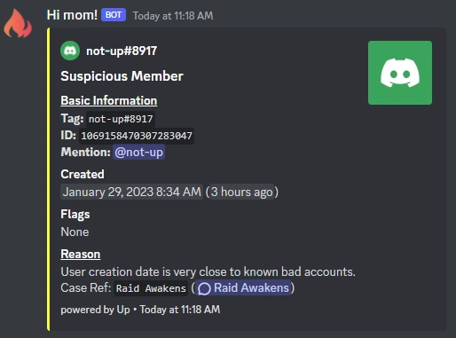

# Quilt Community Collab EWS
A Discord Bot that acts as an Early Warning System for the Quilt Community Collab

<br>
<br>



---

## How to use:

For simplicity, this bot is provided as a docker image.<br>
```
$ docker pull ghcr.io/upcraftlp/quilt-ews:main
```

## Contributing:

1. install [Yarn](https://classic.yarnpkg.com/en/docs/install)
2. Clone the repository
3. Install dependencies<br>
    ```$ yarn```
4. Set up the environment (see [the example file](.env.example))
5. Run the bot in development mode<br>
    ```$ yarn dev```
